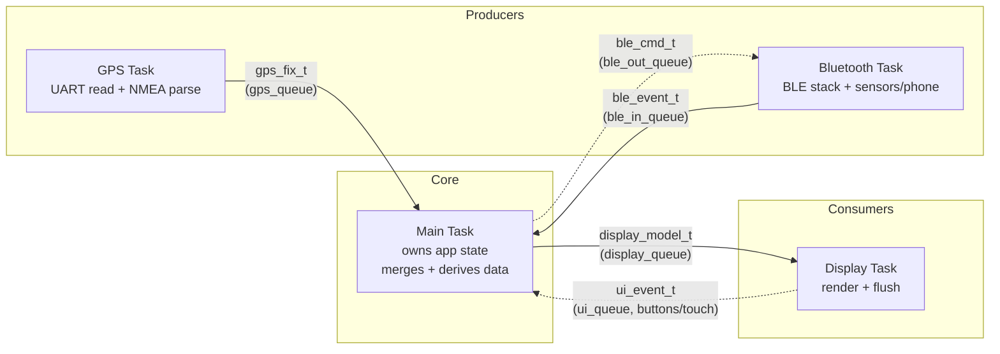

```mermaid
flowchart LR
    subgraph Producers
        GPS[GPS Task<br/>UART read + NMEA parse]
        BT[Bluetooth Task<br/>BLE stack + sensors/phone]
    end

    subgraph Core
        MAIN[Main Task<br/>owns app state<br/>merges + derives data]
    end

    subgraph Consumers
        DISP[Display Task<br/>render + flush]
    end

    GPS -- "gps_fix_t<br/>(gps_queue)" --> MAIN
    BT -- "ble_event_t<br/>(ble_in_queue)" --> MAIN
    MAIN -- "display_model_t<br/>(display_queue)" --> DISP
    MAIN -. "ble_cmd_t<br/>(ble_out_queue)" .-> BT
    DISP -. "ui_event_t<br/>(ui_queue, buttons/touch)" .-> MAIN
```
