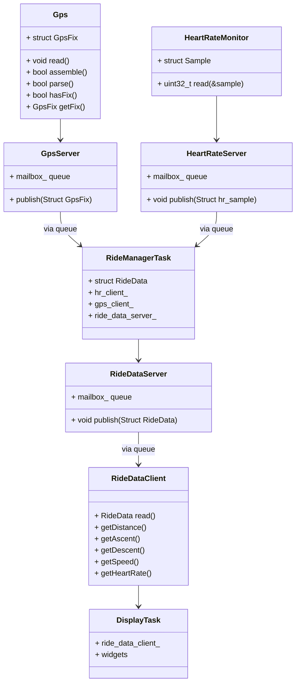

```mermaid
classDiagram

class GpsServer {
    + mailbox_ queue
    + publish(Struct GpsFix)
}

class Gps {
    + struct GpsFix
    + void read()
    + bool assemble()
    + bool parse()
    + bool hasFix()
    + GpsFix getFix()
}

class HeartRateServer {
    + mailbox_ queue
    + void publish(Struct hr_sample)
}

class HeartRateMonitor {
    + struct Sample
    + uint32_t read(&sample)
}

class RideDataServer {
    + mailbox_ queue
    + void publish(Struct RideData)
}

class RideDataClient {
    + RideData read()
    + getDistance()
    + getAscent()
    + getDescent()
    + getSpeed()
    + getHeartRate()
}

class RideManagerTask {
    + struct RideData
    + hr_client_
    + gps_client_
    + ride_data_server_
}

class DisplayTask {
    + ride_data_client_
    + widgets
}

Gps --> GpsServer
GpsServer --> RideManagerTask : via queue
HeartRateMonitor --> HeartRateServer
HeartRateServer --> RideManagerTask : via queue
RideManagerTask --> RideDataServer
RideDataServer --> RideDataClient : via queue
RideDataClient --> DisplayTask
```
